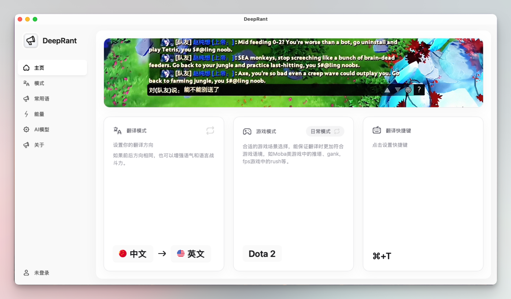

# DeepRant 游戏快捷翻译工具 🎮

<div align="center">
  
  
  [](LICENSE)

</div>

## 🖼️ 功能预览

<div align="center">
  
</div>

## 📝 项目简介

DeepRant 是一款专为游戏玩家设计的多语言快捷翻译工具。它能帮助您在国际服务器中快速进行文字交流，让语言不再成为跨服竞技的障碍。

### ✨ 主要特性

- 🚀 **快捷键翻译**：一键快速翻译，无需切出游戏
- 🌍 **多语言支持**：支持全球主流语言之间的互相翻译
- 🎭 **多种翻译模式**：
  - 😈 嘴臭模式：地道的游戏黑话翻译
  - 🎯 专业玩家模式：专业电竞用语
  - 🤖 自动模式：智能识别场景
- 📚 **常用语管理**：可自定义保存常用短语
- 🎛️ **翻译引擎选择**：支持多种主流翻译模型

## 🎯 使用场景

- 跨服竞技对战
- 国际服务器社交
- 多人在线游戏交流
- 电竞比赛实时沟通

## 🚀 快速开始

1. 从 [Releases](https://github.com/liseami/DeepRant/releases) 下载最新版本
2. 安装程序
3. 运行 DeepRant
4. 设置您喜好的快捷键
5. 开始游戏，享受无障碍交流！

## ⌨️ 默认快捷键

- `CMD + T`: 快速翻译


## 💡 使用技巧

1. 在游戏中选中要翻译的文字
2. 按下设定的快捷键
3. 翻译结果会自动复制到剪贴板
4. 在游戏聊天框中粘贴即可

## 🆓 完全免费

DeepRant 目前完全免费使用，我们相信游戏交流应该没有门槛。

## 🛠️ 技术栈

- 🖥️ **跨平台框架**：[Tauri](https://tauri.app/) - 使用 Rust 构建的轻量级跨平台框架
- ⚛️ **前端框架**：
  - React 18
  - Vite
  - TailwindCSS
  - Framer Motion
- 🦀 **后端技术**：
  - Rust
  - Tauri API
  - Global Shortcut
  - Store Plugin
  - Clipboard Manager

## 👨‍💻 开发指南

### 环境要求

- Node.js 16+
- Rust 1.70+
- macOS: Xcode Command Line Tools
- Windows: Visual Studio C++ 构建工具

### 安装依赖

```bash
# 安装依赖
npm install

# 或使用 yarn
yarn
```

### 开发命令

```bash
# 开发模式
npm run tauri dev

# 清理构建缓存
npm run clean
```

### 打包命令

```bash
# macOS (Intel & Apple Silicon)
npm run tauri build

# macOS (仅 Apple Silicon)
npm run build:mac-arm

# Windows
npm run tauri build
```

## 🤝 贡献指南

欢迎提交 Issue 和 Pull Request！

## 📜 开源协议

本项目采用 MIT 协议开源

---

<div align="center">
  Made with ❤️ for Gamers
</div>
