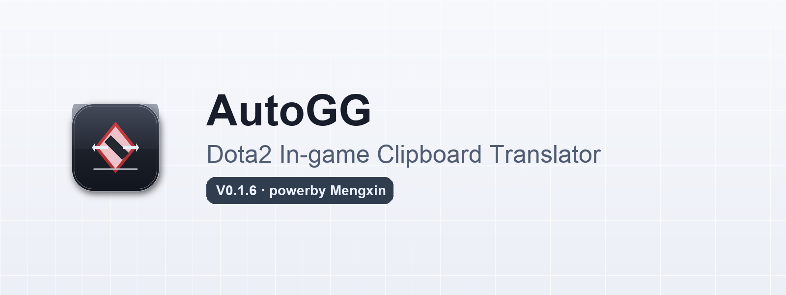

<p align="center">
  
</p>

# AutoGG - Dota2 游戏内聊天翻译客户端

AutoGG 是一个基于 AI 大模型的 Dota2 游戏内聊天翻译工具，面向 Dota2 国际服沟通场景。它加入了 Dota2 专业术语，并针对翻译内容进行润色，更加符合 Dota2 玩家的交流习惯。输入聊天内容后，只需要按下快捷键，即可自动完成翻译，并将翻译后的文本显示在对话窗口中，点击后即可发送翻译后的内容。

- 支持 Windows / macOS
- 支持全局快捷键。自动复制 -> 翻译 -> 自动粘贴
- 支持填写多家模型 API（OpenAI / DeepSeek / Qwen / Moonshot / SiliconFlow / Anthropic / 自定义）
- 支持在设置中切换不同模型厂商

## 功能说明

1. 在 Dota2 聊天框中选中或输入要翻译的文本。
2. 按下翻译快捷键（默认：macOS `⌘+T`，Windows `Alt+T`）。
3. AutoGG 自动读取剪贴板内容并翻译，随后自动粘贴回当前输入框。

## 环境要求

- Node.js 18+
- Rust 1.77+
- Tauri 构建依赖

### macOS

- Xcode Command Line Tools
- 首次运行请在系统设置中授予辅助功能/自动化权限

### Windows

- Visual Studio C++ Build Tools（Desktop development with C++）
- WebView2 Runtime

## 本地运行

```bash
npm install
npm run tauri dev
```

## 打包发布

```bash
npm run tauri build
```

## API 配置

打开应用后进入 `AI模型` 页面：

1. 选择厂商
2. 填写 API Key
3. 确认 API URL 和模型名称
4. 点击“测试连接”

> 自定义厂商支持两种 provider：
> - OpenAI Compatible（`/v1/chat/completions`）
> - Anthropic Messages（`/v1/messages`）

## 许可证

MIT
